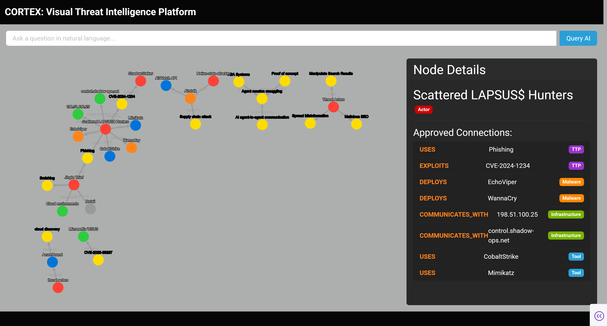

#  Cortex: AI-Powered Threat Intelligence Platform

An AI-driven, graph-based visual platform for automating the ingestion, correlation, and analysis of multi-source cybersecurity threat intelligence.

---

## 🎯 The Problem: Information Overload

Cybersecurity analysts are drowning in data. Threat intelligence is fragmented across dozens of unstructured blogs, technical reports, and raw text feeds (SANS, Unit42, Google/Mandiant).

Manually reading, processing, and correlating entities—such as a new malware strain (`EchoViper`), an IP address (`198.51.100.25`), and an APT group (`ShadowStalker`)—is a slow, error-prone, and unsustainable process. Valuable connections between seemingly disparate reports are missed, leaving organizations vulnerable.

## 💡 The Solution: Automated Visual Correlation

Cortex is an **end-to-end automated platform** that transforms this unstructured text into a high-fidelity, interactive knowledge graph.

It moves analysts from manual text review to a dynamic, queryable visual interface. Instead of asking "Have I read about this malware before?", an analyst can ask "Show me everything connected to this malware" and get an instant visual answer.

---

## 🚀 Core Features

Cortex is not just a dashboard; it's a complete, professional-grade ETL (Extract, Transform, Load) pipeline built with a modern tech stack.

### 1. Hybrid Multi-Source Ingestion
The platform automatically ingests and parses data from multiple industry-standard feeds (SANS, Unit42, Google/Mandiant) using a robust **Scrapy**-based hybrid spider. It intelligently knows whether to extract text directly from an RSS feed or to follow the link and scrape the full article body.

### 2. LLM-Powered Entity Extraction
Unstructured text is sent to a Large Language Model (**Anthropic Claude 3 Haiku**) with a sophisticated prompt. The LLM acts as a senior threat analyst, identifying and extracting key entities (Actors, Malware, TTPs, Tools, Infrastructure) and their relationships.

### 3. Graph-Based Correlation Backend
Extracted entities are not stored in a simple table; they are loaded into a **Neo4j graph database**. Using `MERGE` logic, the system automatically correlates entities, ensuring that a mention of "ShadowStalker" from a SANS report and a "ShadowStalker" mention from a Unit42 report point to the *exact same node* in the graph.

### 4. Interactive Graph Visualization
A **Plotly Dash** and **Dash-Cytoscape** front-end provides a rich, interactive visualization of the correlated data. The UI is built with Dash Bootstrap Components (DBC) using a professional dark theme ("Cyborg") and features a dynamic details panel that queries and displays live connection data.

### 5. Natural Language Query (NLQ)
Analysts can query the graph using plain English. A secondary AI prompt translates questions like "What tools does ShadowStalker use?" into a precise **Cypher** query, which then filters the graph in real-time.

### 6. Human-in-the-Loop (HITL) Staging
**This is the project's most professional feature.** To prevent AI "hallucinations" from corrupting the production database, Cortex implements a two-stage data pipeline:
* **Staging:** All AI findings (nodes and relationships) are first written to the graph with a `status: 'pending'` property.
* **Review Panel:** A separate, secure Dash application (`review_app.py`) allows a human analyst to review each pending node and relationship, view its source article, and either **Approve** (setting `status: 'approved'`) or **Reject** (deleting) the data.
* **Production:** The main dashboard (`app.py`) **only** displays data that has `status: 'approved'`, ensuring 100% data quality and analyst control.

---

## 🔧 Tech Stack & Architecture

* **Backend & Pipeline:** Python, Scrapy, Feedparser, BeautifulSoup4, `python-dotenv`
* **Database:** Neo4j (Graph Database)
* **AI / NLP:** Anthropic Claude 3 Haiku (via API)
* **Frontend & Visualization:** Plotly Dash, Dash-Bootstrap-Components, Dash-Cytoscape
* **Automation:** Windows Task Scheduler with a `.bat` script for daily execution.

### Project Flow
1.  **Automation (`run_daily.bat`):** A scheduled task kicks off the pipeline.
2.  **Extract (`ingestor.py`):** Scrapy spider scrapes 3+ threat feeds and saves articles.
3.  **Transform (`run_pipeline.py`):**
    * Reads articles.
    * Sends text to **Anthropic AI** (`ai_extractor.py`) to get a JSON of entities.
4.  **Load (`run_pipeline.py`):**
    * Connects to **Neo4j** (`graph_manager.py`).
    * Writes all entities with `status: 'pending'`.
5.  **Review (`review_app.py`):**
    * An analyst visits the Review Panel (port 8051).
    * Approves or rejects nodes and relationships.
6.  **Analyze (`app.py`):**
    * The main dashboard (port 8050) displays *only* data with `status: 'approved'`.
    * The analyst uses the NLQ to query the verified graph.

    